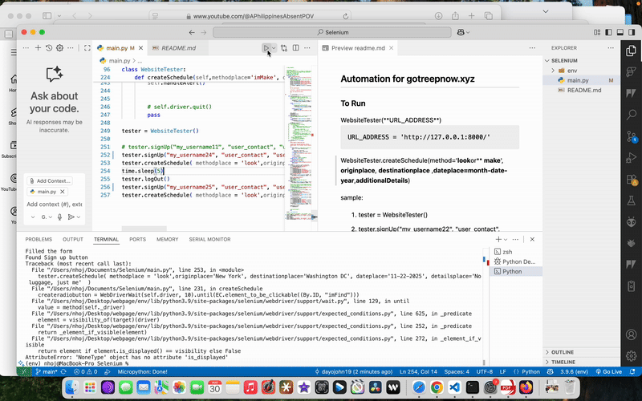

<h2> Automation for gotreepnow.xyz</h2>

<!-- https://ezgif.com/video-to-gif -->

<h3>To Run</h3>
WebsiteTester(**URL_ADDRESS**)

    URL_ADDRESS = 'http://127.0.0.1:8000/'

WebsiteTester.createSchedule(method='**look**or** **make**', **originplace**, **destinationplace** ,**dateplace=month-date-year**,**additionalDetails**)

sample: 
1. tester = WebsiteTester()
2. tester.signUp("my_username22", "user_contact", "user_password")

3. tester.createSchedule( methodplace = 'look',originplace='New York', destinationplace='Washington DC', dateplace='11-22-2025', detailsplace='No luggage, just me'  )

4. tester.logOut()

5. tester.signUp("my_username23", "user_contact", "user_password")

6. tester.createSchedule( methodplace = 'look',originplace='New York2', destinationplace='Washington DC', dateplace='11-22-2025', detailsplace='No luggage, just me'  )